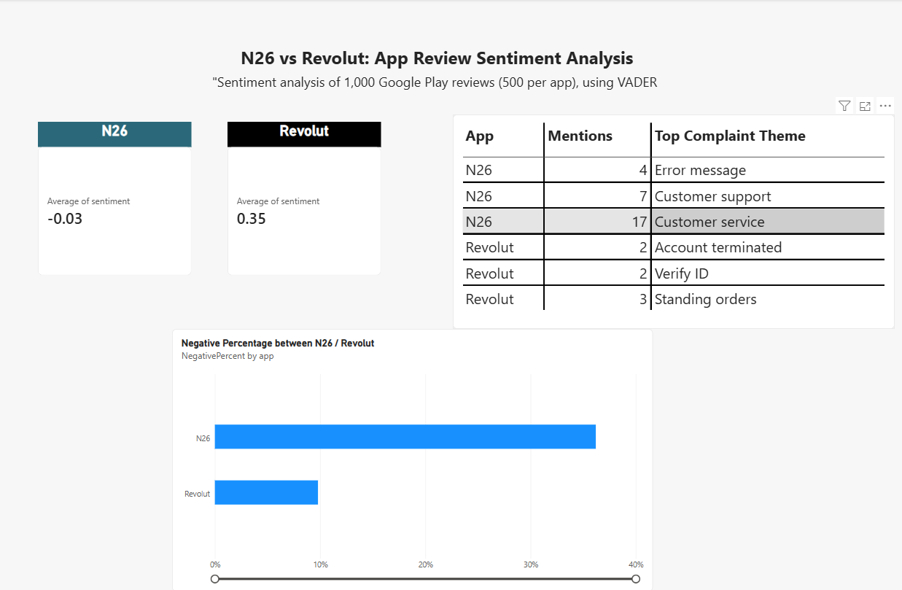

# N26 vs Revolut: App Review Sentiment Analysis

Comparing customer sentiment between two major European fintech apps using real Google Play Store reviews.

## What it does
Scrapes public app reviews for N26 and Revolut, runs sentiment analysis using VADER, and compares complaint patterns between the two companies.

## Dashboard

## Data
- 500 reviews per app (1,000 total), pulled via Google Play Store (Android only — see Limitations)
- Source: `google-play-scraper` Python library

## Methodology
- Sentiment scored using VADER (rule-based sentiment analysis), giving each review a compound score from -1 to +1
- Reviews below -0.3 sentiment classified as "negative" for comparison purposes
- Top complaint themes identified using bigram (two-word phrase) frequency analysis on negative reviews, with generic finance-app terms filtered out

## Findings
- **Average sentiment:** N26 -0.03 (neutral-to-negative) vs Revolut +0.35 (clearly positive)
- **Share of negative reviews:** N26 36% (181/500) vs Revolut 10% (49/500) — a striking gap in review volume, not just tone
- **N26's complaints cluster around:** customer service/support access, and recurring technical errors
- **Revolut's (fewer) complaints cluster around:** account termination and identity verification — smaller in volume, but more severe in nature

## Limitations
- Google Play only — excludes iOS users (~40% of the German market), a known gap
- Some non-English reviews slipped through the language filter and may slightly affect results
- VADER is rule-based and can miss typos, sarcasm, or subtle phrasing (spot-checked manually, found a few misclassifications)

## Tech stack
Python, pandas, google-play-scraper, VADER (vaderSentiment), scikit-learn, Power BI
